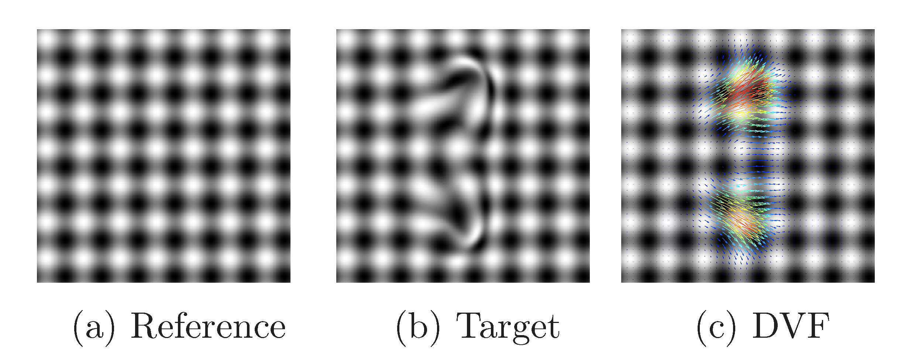

This repository contains a pair of synthetic 2D images in gray 
scale related to each other by a smooth deformation. 

A pair of DVFs obtained by the ANTs software are also added
along with the script that generated these DVFs.

Synthetic images (a-b) and forward DVF (c) are visualized below.

 

Software dependency:

http://stnava.github.io/ANTs/
